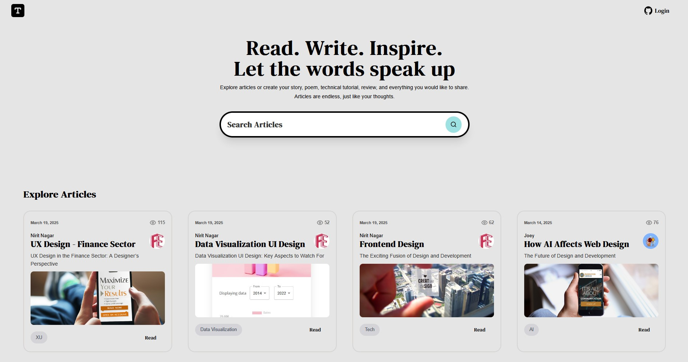

# Articles Blog App



User can read articles or login with GitHub to create articles.

👉 [Watch DEMO](https://nextjs-15-sanity-blog-gules.vercel.app/)

## 📁 Project Structure

- **App Router** structure model.
- **app/page.tsx** is the main page.
- The **article** and **user** are dynamic folders.

## ✏️ Notes

- **Next.js 15 / TypeScript** app.
- **ShadCN** UI.
- Data hande by **Sanity**.
- Deploy on **Vercel**.

## 🌈 Localhost View

```bash
npm run dev
# or
yarn dev
# or
pnpm dev
# or
bun dev
```

Open [http://localhost:3000](http://localhost:3000) with your browser to see the result.

---

👉 [Watch DEMO](https://nextjs-15-sanity-blog-gules.vercel.app/)

---

### License

Copyright © 2019 @frnt-end
[Portfolio](https://frnt-end.github.io/portfolio/)

[](https://opensource.org/licenses/Apache-2.0)
